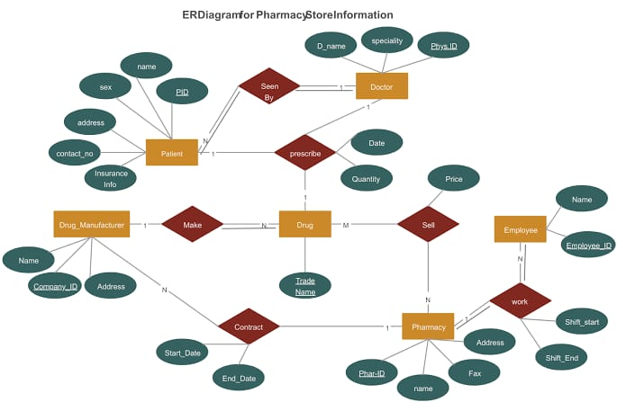

# 🏥 Pharmacy Management System

This repository contains a **Pharmacy Management System** built using **Flask**, a lightweight Python web framework, and **SQLAlchemy** for ORM-based database management. The system is designed to manage information related to:

- Patients  
- Doctors  
- Drugs and Drug Manufacturers  
- Employees and Pharmacies  
- Contracts  

All entities and their relationships are structured according to the provided ER diagram.

---

## 📊 ER Diagram

> *(Insert the ER diagram image here)*  
> Example:  
> 

---

## 🚀 Features

- Manage **patient records**, including personal details and insurance info.
- Store **doctor information**, with specialties.
- Track **drug inventory**, pricing, and manufacturer info.
- Manage **employee schedules** and **pharmacy assignments**.
- Maintain **contract details** between pharmacies and manufacturers.
- Provide **RESTful API endpoints** for full CRUD operations on all entities.

---

## ⚙️ Installation

Follow these steps to set up the project locally:

### 1. Clone the Repository

bash
git clone https://github.com/yourusername/pharmacy-management.git
cd pharmacy-management

### 2. Install Required Packages

bash
pip install -r requirements.txt

### 3.Initialize the Database

bash
python app.py

### 4. Run the Application

bash
python app.py

the application will be available at:hhtp://localhost:5000
